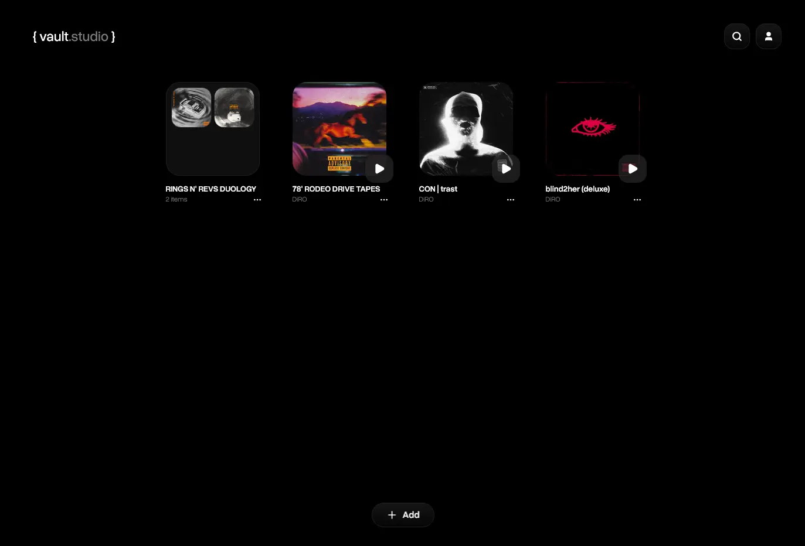
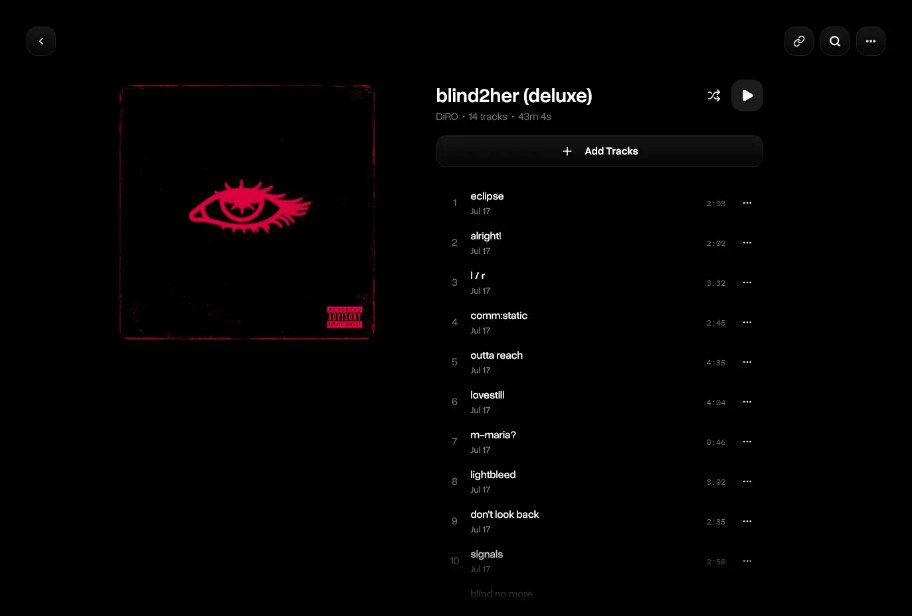
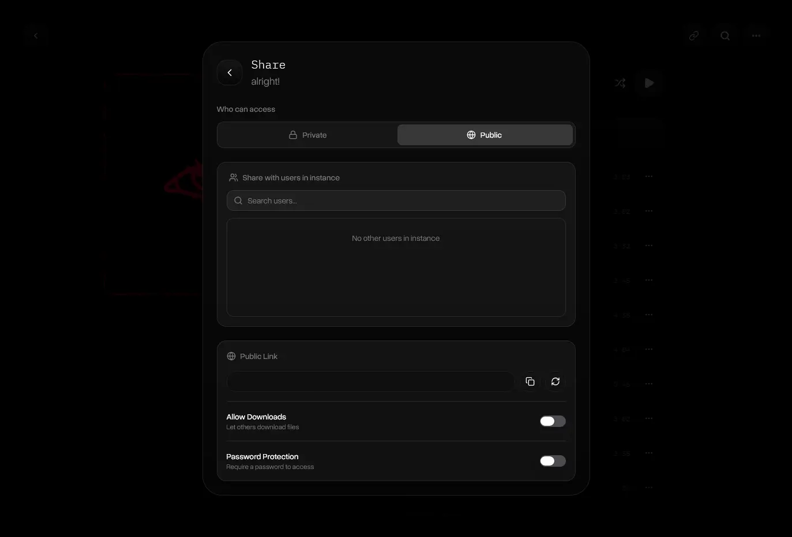
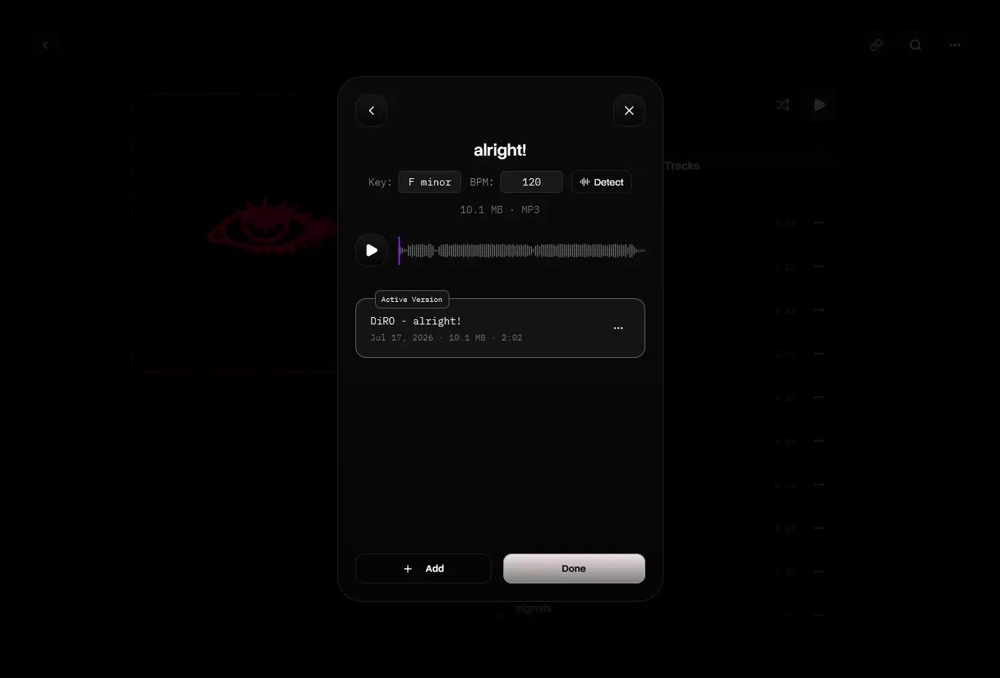
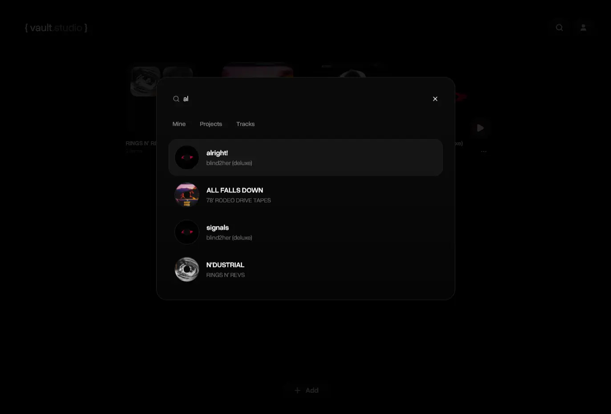
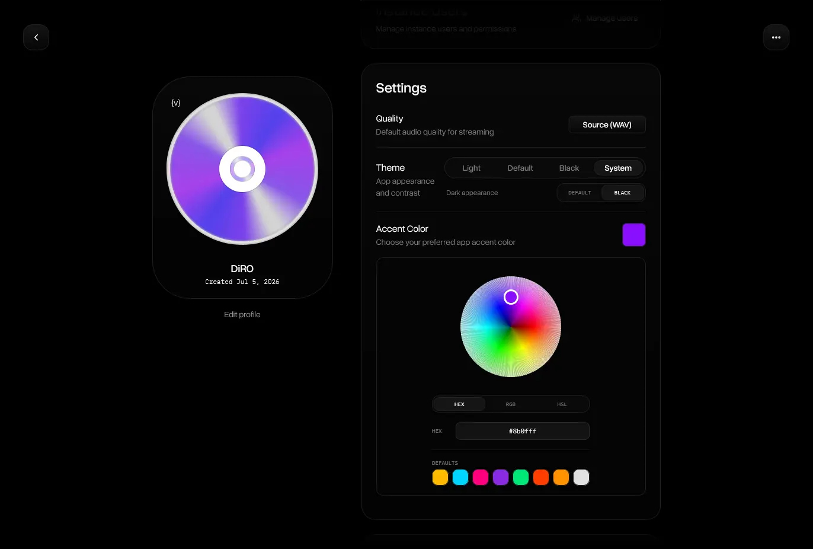

<div align="center">


# { vault.studio }

**An artist-focused fork of [{ vault }](https://github.com/bungleware/vault).**

Self-hosted streaming, organization, and creative tools for work-in-progress music.

[](https://github.com/ILostXD/vault_studio/releases/latest)
[](LICENSE)
[](https://github.com/bungleware/vault)



<details>
  <summary>More screenshots</summary>
  
  
  
  
  
</details>

</div>

## About This Fork

`{ vault.studio }` is an independent, artist-focused fork of [{ vault }](https://github.com/bungleware/vault) by [bungleware](https://github.com/bungleware). The original developer created the core application and the large majority of its foundation. This fork builds on that work with additional tools for artists, demos, and mobile listening; it is not intended to diminish or replace the upstream project.

The project is also inspired by [untitled](https://untitled.stream/), while remaining open source and self-hosted.

## What Vault Studio Adds

- Native Android app with a selectable self-hosted backend URL, including raw HTTP support for local networks
- Android media controls and track metadata for the notification player and connected devices
- Automatic BPM and musical-key analysis, plus manual re-detection
- Rich per-track notes with formatting and autosave
- Mobile voice-memo capture that uploads ideas directly into a project
- Light, Default, Black, and System themes with a configurable accent color
- Mobile-focused layouts, edge-to-edge Android presentation, and gesture-aware navigation

## Core Vault Features

These features come from the upstream project and remain central to this fork:

- Store and stream audio projects and track versions
- Invite users and collaborate within one instance
- Share projects and tracks publicly with download, password, and permission controls
- Organize projects in nested folders
- Export and import an instance as a ZIP backup

## Install

### Android

Download the APK from the [latest GitHub release](https://github.com/ILostXD/vault_studio/releases/latest). Android may ask you to allow installs from your browser or file manager.

On first launch, enter the full URL of your self-hosted instance, including `http://` or `https://` and its port when required.

### Self-hosted Server

Requires Git, Docker, and Docker Compose. This fork currently builds locally from source; no prebuilt container image is published.

```bash
git clone https://github.com/ILostXD/vault_studio.git
cd vault_studio
cp .env.example .env
```

Set `JWT_SECRET`, `SIGNED_URL_SECRET`, and `TOKEN_PEPPER` in `.env` to different random values. Generate each value with:

```bash
openssl rand -base64 32
```

Then build and start the application:

```bash
docker compose up -d --build
```

The app is available at `http://localhost:8080` by default. Runtime data is stored in `./data`.

To update an existing checkout:

```bash
git pull --ff-only
docker compose up -d --build
```

## Configuration

| Variable | Description | Default |
| --- | --- | --- |
| `JWT_SECRET` | Secret used to sign access tokens | Required |
| `SIGNED_URL_SECRET` | Secret used to sign media URLs | Required |
| `TOKEN_PEPPER` | Pepper used when hashing tokens | Required |
| `HOST_PORT` | Port exposed on the host | `8080` |
| `ACCESS_TOKEN_TTL` | Access-token lifetime | `15m` |
| `REFRESH_TOKEN_TTL` | Refresh-token lifetime | `720h` |
| `SIGNED_URL_TTL` | Signed media URL lifetime | `5m` |
| `CORS_ALLOWED_ORIGINS` | Comma-separated additional frontend origins | Local defaults |
| `LOG_LEVEL` | Log verbosity (`debug`, `info`, `warn`, `error`) | `warn` |

## Development

See [docs/DEVELOPMENT.md](docs/DEVELOPMENT.md).

## Credits And License

Most of the original application was created by [bungleware](https://github.com/bungleware) and the [{ vault } contributors](https://github.com/bungleware/vault/graphs/contributors). Fork-specific additions are maintained in this repository. See the Git history for a complete attribution trail.

This project remains available under the [GNU Affero General Public License v3.0](LICENSE). Parts of this fork were developed with coding-model assistance; see [CONTRIBUTING.md](CONTRIBUTING.md) for the project policy.
