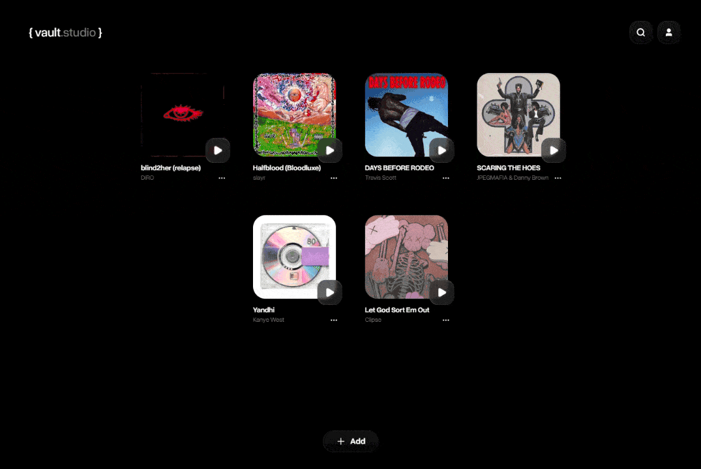
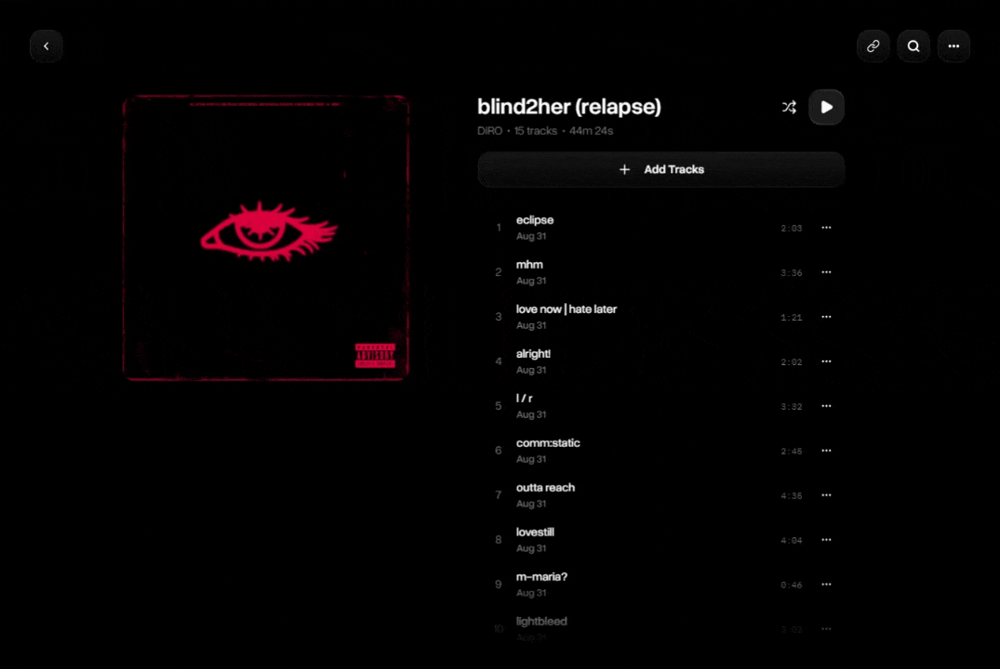
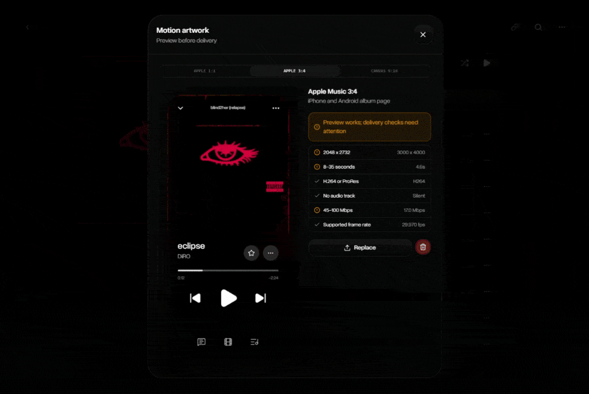
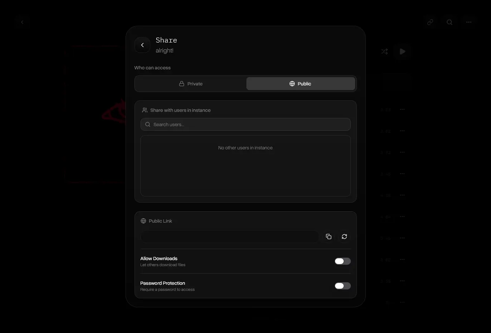
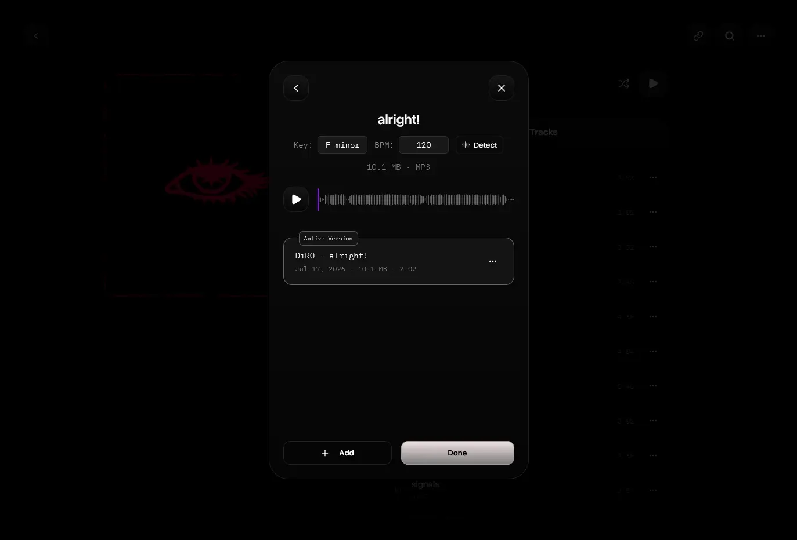
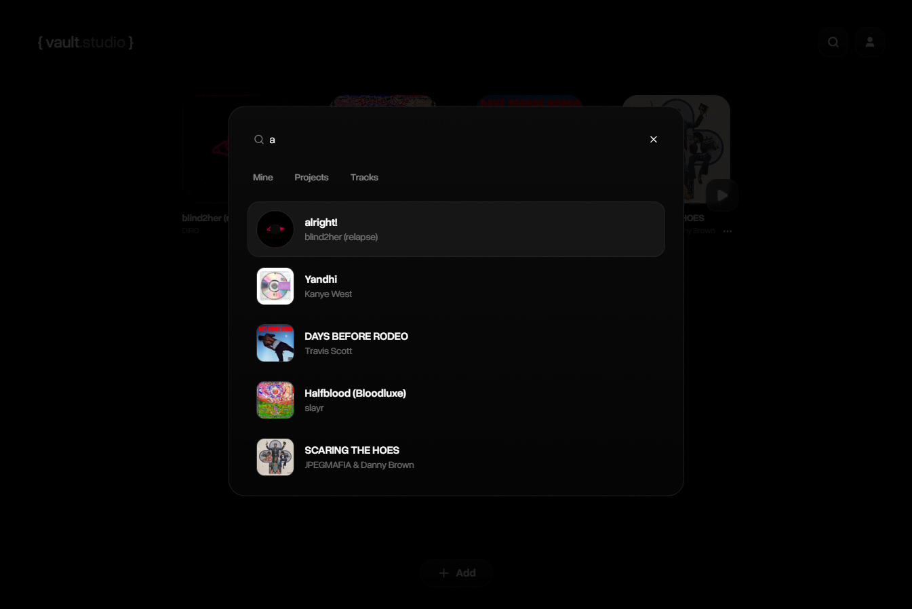
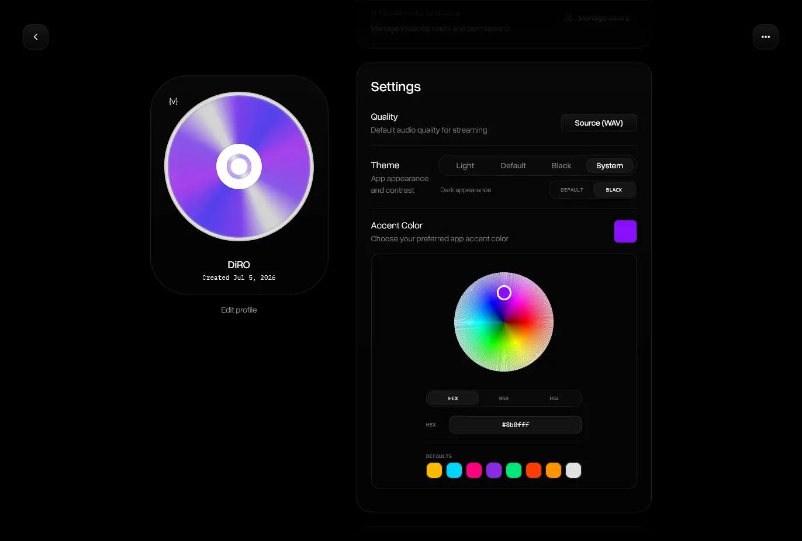

<div align="center">


# { vault.studio }

**An artist-focused fork of [{ vault }](https://github.com/bungleware/vault).**

Self-hosted streaming, organization, and creative tools for work-in-progress music.

[](https://github.com/ILostXD/vault_studio/releases/latest)
[](LICENSE)
[](https://github.com/bungleware/vault)



<details>
  <summary>More screenshots</summary>
  
  
  
  
  
  
</details>

<sub><em>Demo media notice: the projects shown in these GIFs are not my work and appear only to demonstrate the interface. They include DAYS BEFORE RODEO, Halfblood (Bloodluxe), SCARING THE HOES, Yandhi, Let God Sort Em Out, and blind2her (relapse). All rights remain with their respective artists and rights holders.</em></sub>

</div>

## About This Fork

`{ vault.studio }` is an independent, artist-focused fork of [{ vault }](https://github.com/bungleware/vault) by [bungleware](https://github.com/bungleware). The original developer created the core application and the large majority of its foundation. This fork builds on that work with additional tools for artists, demos, and mobile listening; it is not intended to diminish or replace the upstream project.

The project is also inspired by [untitled](https://untitled.stream/), while remaining open source and self-hosted.

## What {vault.studio} Adds

- Native Android app with a selectable self-hosted backend URL, including raw HTTP support for local networks
- Android media controls and track metadata for the notification player and connected devices
- Automatic BPM and musical-key analysis, plus manual re-detection
- Rich per-track notes with formatting and autosave
- Mobile voice-memo capture that uploads ideas directly into a project
- Animated artwork management and previews for Apple Music `1:1` and `3:4` motion artwork and Spotify Canvas `9:16` video
- Release preparation with reusable credits, validation, distributor-ready ZIP packages, and Too Lost draft delivery
- Light, Default, Black, and System themes with a configurable accent color
- Mobile-focused layouts, edge-to-edge Android presentation, and gesture-aware navigation

### Motion Artwork Preview

Upload animated artwork once and inspect it in responsive, platform-inspired previews before delivery. `{ vault.studio }` retains the original source, creates a silent browser-compatible preview with FFmpeg, and checks dimensions, duration, codec, frame rate, bitrate, and audio presence against the selected format. Apple Music portrait previews also simulate the live blurred color continuation behind the player controls as the artwork changes.

> [!NOTE]
> Animated artwork previews are an informed estimation, not a pixel-perfect reproduction of Apple Music or Spotify. Final rendering can vary by platform, device, operating system, and app version.

## Release Preparation And Distribution

Vault Studio can turn an existing project into a validated release without asking the artist to rebuild information that Vault already knows. Open a project, choose **Prepare Release** from its menu, and work through four focused views:

1. **Release** reviews the title, artist, release type, dates, language, genres, label, C-line, P-line, UPC, and reusable credits.
2. **Tracks** reviews titles, artists, languages, explicit status, optional ISRCs and lyrics, with per-track credit overrides where needed.
3. **Deliver** shows blocking issues, exports a provider-neutral Release Package, or creates and updates a connected Too Lost draft.
4. **History** records exports and distributor drafts with the exact metadata and asset hashes used at that time.

Set the artist/display name, legal name, and reusable credits in **Profile > Artist Profile** first. Reusable credits are inherited by every track, while individual tracks can still override them. Vault only sends values it actually knows: missing distributor-specific settings remain visibly unfinished instead of being guessed.

### Release Package

Release Package export works without a distributor account and preserves the active original masters. The generated ZIP contains:

```text
Release/
|-- Audio/                 Original active masters
|-- Artwork/               Square cover and available motion artwork
|-- Metadata/release.json  Machine-readable release snapshot
|-- Metadata/tracks.csv
|-- Credits/credits.csv
|-- checksums.sha256
`-- README.txt
```

Apple Motion `1:1`, Apple Motion `3:4`, and Spotify Canvas files are included when they exist. Vault never replaces or destructively converts the stored master for this export.

### Too Lost Workflow

When Too Lost is connected, Vault uses Too Lost's genre and language catalogs, uploads temporary FLAC delivery copies, sends known release metadata and the square cover, and creates or updates a **draft**. Vault never calls a final-submission endpoint. The artist finishes stores, territories, licensing, motion artwork, review, and submission in Too Lost.

The current integration supports audio releases of type Single, EP, Album, and Compilation. Apple motion artwork remains in the Release Package because Too Lost's published API does not yet define a stable contract for Vault's MP4 assets. Existing ISRC and UPC values are optional; leave them blank when Too Lost should assign them.

## Core {vault} Features

These features come from the upstream project and remain central to this fork:

- Store and stream audio projects and track versions
- Invite users and collaborate within one instance
- Share projects and tracks publicly with download, password, and permission controls
- Organize projects in nested folders
- Export and import an instance as a ZIP backup

## Install

### Android

Download the APK from the [latest GitHub release](https://github.com/ILostXD/vault_studio/releases/latest). Android may ask you to allow installs from your browser or file manager.

On first launch, enter the full URL of your self-hosted instance, including `http://` or `https://` and its port when required.

### Self-hosted Server

Requires Git, Docker, and Docker Compose. The default command builds locally from source. Tagged releases also publish the server and audio-analysis images to GitHub Container Registry for in-app updates.

```bash
git clone https://github.com/ILostXD/vault_studio.git
cd vault_studio
cp .env.example .env
```

Set `JWT_SECRET`, `SIGNED_URL_SECRET`, and `TOKEN_PEPPER` in `.env` to different random values. Generate each value with:

```bash
openssl rand -base64 32
```

Then build and start the application:

```bash
docker compose up -d --build
```

The app is available at `http://localhost:8080` by default. Runtime data is stored in `./data`.

To update an existing checkout:

```bash
git pull --ff-only
docker compose up -d --build
```

### In-app Updates

Admins can check GitHub Releases from **Settings > Instance Information**. Vault's GitHub Actions workflow builds the server and audio-analysis Docker images and publishes them to this repository's GitHub Container Registry (GHCR) packages whenever a version tag such as `v1.1.0` is pushed. Docker Hub is not required.

The updater does not run `git pull`, build the newest `main` commit, or publish images itself. It only pulls the `latest` images produced by a tagged GitHub release. Before enabling it, make both GHCR packages public:

- `ghcr.io/ilostxd/vault_studio`
- `ghcr.io/ilostxd/vault_studio-audio-analysis`

Then start Vault once with the isolated updater override to enable the **Update** button:

```bash
docker compose -f docker-compose.yml -f docker-compose.updates.yml up -d --build
```

After that one-time setup, each future tagged release can be installed from Settings without running Git or Compose commands again. The updater pulls the published GHCR images, preserves the existing `./data` mount, and restarts the Vault services. It is not exposed on a host port, uses the instance JWT secret for its internal request, and only its dedicated Watchtower container receives the Docker socket. Keep `JWT_SECRET` private. Android APK updates remain handled by Obtainium or the GitHub release page.

## Configuration

| Variable | Description | Default |
| --- | --- | --- |
| `JWT_SECRET` | Secret used to sign access tokens | Required |
| `SIGNED_URL_SECRET` | Secret used to sign media URLs | Required |
| `TOKEN_PEPPER` | Pepper used when hashing tokens | Required |
| `HOST_PORT` | Port exposed on the host | `8080` |
| `ACCESS_TOKEN_TTL` | Access-token lifetime | `15m` |
| `REFRESH_TOKEN_TTL` | Refresh-token lifetime | `720h` |
| `SIGNED_URL_TTL` | Signed media URL lifetime | `5m` |
| `CORS_ALLOWED_ORIGINS` | Comma-separated additional frontend origins | Local defaults |
| `LOG_LEVEL` | Log verbosity (`debug`, `info`, `warn`, `error`) | `warn` |
| `TOOLOST_CLIENT_ID` | Too Lost OAuth application client ID | Optional |
| `TOOLOST_CLIENT_SECRET` | Too Lost OAuth application client secret | Optional |
| `TOOLOST_ENVIRONMENT` | Too Lost API environment (`sandbox` or `production`) | `sandbox` |
| `PUBLIC_BASE_URL` | Public HTTPS instance URL used for OAuth callbacks | Required for Too Lost |
| `PROVIDER_TOKEN_ENCRYPTION_KEY` | Advanced override: base64-encoded 32-byte key for provider credentials | Derived from `JWT_SECRET` |

### Too Lost Drafts

1. Give Vault a stable public HTTPS address using a reverse proxy or HTTPS tunnel.
2. Open **Settings > Too Lost distribution** as an administrator and enter that public URL to preview the exact callback URL.
3. Register an OAuth application in the [Too Lost Developer Portal](https://developer.toolost.com/) using that callback URL.
4. Enter the issued client ID and secret in Vault, save the settings, then connect Too Lost from the Prepare Release delivery view. No rebuild is required.

Vault encrypts the OAuth client secret and connected-account tokens in its database using a key derived from the existing private `JWT_SECRET`. The secret is never returned to the browser after it is saved. Existing installations may keep configuring Too Lost through environment variables; these act as startup defaults until an administrator saves settings in the app:

```dotenv
TOOLOST_CLIENT_ID=your-client-id
TOOLOST_CLIENT_SECRET=your-client-secret
TOOLOST_ENVIRONMENT=sandbox
PUBLIC_BASE_URL=https://vault.example.com
# Optional advanced override. Do not change it after connecting accounts.
PROVIDER_TOKEN_ENCRYPTION_KEY=your-separate-32-byte-base64-key
```

The Settings page shows whether Too Lost is configured and displays the exact OAuth callback URL to register. Release Package export remains the no-registration fallback. The static square cover is included in both the package and Too Lost drafts when it is available; Apple motion artwork remains package-only until Too Lost publishes a stable MP4 upload contract.

`PUBLIC_BASE_URL` must be a stable public HTTPS address that reaches Vault's HTTP server so Too Lost can return the OAuth callback and fetch the short-lived signed cover URL. A reverse proxy or HTTPS tunnel is sufficient; the database, Docker socket, and audio-analysis service must remain private. Use `production` only after Too Lost grants production access and the registered application uses the production callback.

Disconnecting Too Lost removes the stored provider credential but leaves Vault release preparations and distribution history intact. Provider credentials and in-app integration settings are encrypted at rest.

## Development

See [docs/DEVELOPMENT.md](docs/DEVELOPMENT.md).

## Credits And License

Most of the original application was created by [bungleware](https://github.com/bungleware) and the [{ vault } contributors](https://github.com/bungleware/vault/graphs/contributors). Fork-specific additions are maintained in this repository. See the Git history for a complete attribution trail.

The animated fullscreen artwork background was informed by Aadish Verma's research, [Reverse engineering Apple Music's background gradient](https://www.aadishv.dev/music). Vault Studio's implementation was written independently using the existing React and CSS animation stack.

This project remains available under the [GNU Affero General Public License v3.0](LICENSE). Parts of this fork were developed with coding-model assistance; see [CONTRIBUTING.md](CONTRIBUTING.md) for the project policy.
